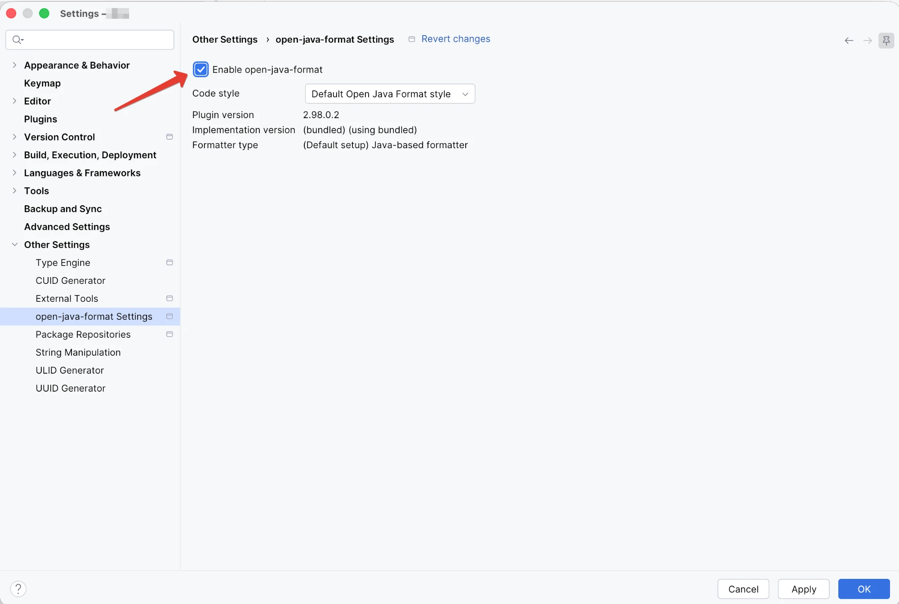
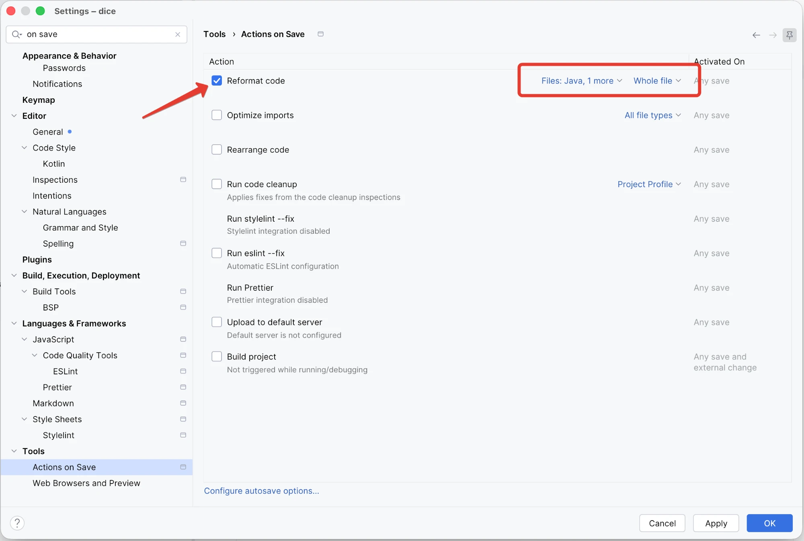

# IntelliJ IDEA

With the plugin enabled, **Reformat Code** runs open-java-format instead of the IDE's built-in Java
formatter, so the IDE and the build produce identical files. The IDE's own Java code style settings
stop applying.

The plugin needs IntelliJ IDEA 2024.2 or later, or another JetBrains IDE with Java support, such as
Android Studio.

<iframe src="https://plugins.jetbrains.com/embeddable/card/34359" width="384" height="319" title="open-java-format on the JetBrains Marketplace" loading="lazy" style="border: 0; max-width: 100%;"></iframe>

## Install

### From the JetBrains Marketplace

1. Open **Settings**, go to **Plugins** and switch to the **Marketplace** tab.
2. Search for **open-java-format** and click **Install**.
3. Restart the IDE.

The [plugin page](https://plugins.jetbrains.com/plugin/34359-open-java-format) on the Marketplace
has an **Install to IDE** button that does the same for an IDE that is already running.

### From a file

A version that is not on the Marketplace yet can be installed from a release.

1. Download `open-java-format-idea-plugin-{{ ojf_version }}.zip` from the
   [latest release](https://github.com/openjavaformat/open-java-format/releases/latest). Do not
   unpack it.
2. Open **Settings**, go to **Plugins**, click the gear icon and choose **Install Plugin from
   Disk…**.
3. Select the zip file and restart the IDE.

## Enable it for a project

The plugin is off in every project until you turn it on.

1. Open **Settings** and go to **Other Settings → open-java-format Settings**.
2. Tick **Enable open-java-format**.

{ width="565" height="455" loading="lazy" }

From then on Reformat Code, ++ctrl+alt+l++ or ++option+cmd+l++ on macOS, formats Java files with
open-java-format.

## Format on save

1. Open **Settings** and go to **Tools → Actions on Save**.
2. Tick **Reformat code**.
3. Next to it, choose **Java** in the file list and **Whole file** instead of **Changed lines**.

{ width="1000" height="674" loading="lazy" }

Limiting it to Java keeps other files out: the IDE would reformat those with its own formatters.
**Whole file** formats the entire file, which is what the [GitHub Action](github-actions.md) checks.
**Changed lines** formats only the lines you edited, the way `formatDiff` does.

## Which formatter version runs

A project that applies the [Gradle plugin](gradle.md) takes the formatter version from the build.
Every other project uses the version bundled with the IDE plugin, which the settings page shows as
`(bundled)` under **Implementation version**, as in the screenshot above.

By default the formatter runs in a process of its own, on the IDE's runtime, so the project SDK can
be any version.

## Native binary

In a project with the [Gradle plugin](gradle.md), the IDE can run the formatter as the native binary
that the build uses. It is switched on in the build, not in the IDE:

``` properties title="gradle.properties"
openjavaformat.native.formatter=true
```

After the next Gradle sync in the IDE, the plugin writes the path of the binary into
`.idea/open-java-format.xml`, and **Formatter type** on the settings page changes from
**Java-based formatter** to **Native image formatter**. Each reformat starts the formatter as a new
process, and the native binary starts without a JVM.

The binary runs on the platforms listed on the
[Gradle plugin](gradle.md#choose-how-the-formatter-runs) page. Elsewhere the plugin ignores the
property, and the IDE keeps the Java-based formatter.
